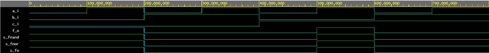
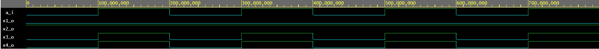
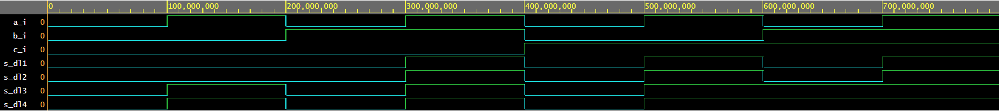

# LAB 01-gates

### Link to GitHub repository
[GitHub repository](https://github.com/xkocum00/Digital-electronics-1.git)


## Part 3: EDA Playground

### De Morgan's laws


| **c** | **b** |**a** | **f(c,b,a)** |
| :-: | :-: | :-: | :-: |
| 0 | 0 | 0 | 1 |
| 0 | 0 | 1 | 1 |
| 0 | 1 | 0 | 0 |
| 0 | 1 | 1 | 0 |
| 1 | 0 | 0 | 0 |
| 1 | 0 | 1 | 1 |
| 1 | 1 | 0 | 0 |
| 1 | 1 | 1 | 0 |


## Experiments on your own
### Boolean postulates

### VHDL CODE design.vhd
```------------------------------------------------------------------------
--
-- Example of basic OR, AND, XOR gates.
-- Nexys A7-50T, Vivado v2020.1, EDA Playground
--
-- Copyright (c) 2019-2020 Tomas Fryza
-- Dept. of Radio Electronics, Brno University of Technology, Czechia
-- This work is licensed under the terms of the MIT license.
--
------------------------------------------------------------------------

library ieee;               -- Standard library
use ieee.std_logic_1164.all;-- Package for data types and logic operations

------------------------------------------------------------------------
-- Entity declaration for basic gates
------------------------------------------------------------------------
entity gates is
    port(
        a_i    : in  std_logic;         -- Data input
        b_i    : in  std_logic;         -- Data input
        c_i	   : in  std_logic;
        f_o    : out std_logic;         -- OR output function
        fnand_o : out std_logic         -- AND output function
        --fxor_o : out std_logic          -- XOR output function
    );
end entity gates;

------------------------------------------------------------------------
-- Architecture body for basic gates
------------------------------------------------------------------------
architecture dataflow of gates is
begin
    f_o  <= ((not b_i) and a_i) or ((not c_i) and (not b_i));
    fnand_o <= a_i;
    --fand_o <= a_i and b_i;
    --fxor_o <= a_i xor b_i;

end architecture dataflow;

```
### VHDL CODE testbench.vhd
```------------------------------------------------------------------------
--
-- Testbench for basic gates circuit.
-- Nexys A7-50T, Vivado v2020.1, EDA Playground
--
-- Copyright (c) 2020 Tomas Fryza
-- Dept. of Radio Electronics, Brno University of Technology, Czechia
-- This work is licensed under the terms of the MIT license.
--
------------------------------------------------------------------------

library ieee;
use ieee.std_logic_1164.all;

------------------------------------------------------------------------
-- Entity declaration for testbench
------------------------------------------------------------------------
entity tb_gates is
    -- Entity of testbench is always empty
end entity tb_gates;

------------------------------------------------------------------------
-- Architecture body for testbench
------------------------------------------------------------------------
architecture testbench of tb_gates is

    -- Local signals
    signal s_a    : std_logic;
    signal s_b    : std_logic;
    signal s_c    : std_logic;
    signal s_f    : std_logic;
    --signal s_fand : std_logic;
    --signal s_fxor : std_logic;

begin
    -- Connecting testbench signals with gates entity (Unit Under Test)
    uut_gates : entity work.gates
        port map(
            a_i    => s_a,
            b_i    => s_b,
            c_i    => s_c,
            f_o    => s_f
            --fand_o => s_fand
            --fxor_o => s_fxor
        );

    --------------------------------------------------------------------
    -- Data generation process
    --------------------------------------------------------------------
    p_stimulus : process
    begin
    	s_c <= '0';
        s_b <= '0';  
        s_a <= '0';
        wait for 100 ns;
        s_c <= '0';
        s_b <= '0';
        s_a <= '1';
        wait for 100 ns;
        s_c <= '0';
        s_b <= '1';
        s_a <= '0';
        wait for 100 ns;
        s_c <= '0';
        s_b <= '1';
        s_a <= '1';
        wait for 100 ns;
        s_c <= '1';
        s_b <= '0';  
        s_a <= '0';
        wait for 100 ns;
        s_c <= '1';
        s_b <= '0';
        s_a <= '1';
        wait for 100 ns;
        s_c <= '1';
        s_b <= '1';
        s_a <= '0';
        wait for 100 ns;
        s_c <= '1';
        s_b <= '1';
        s_a <= '1';
        wait for 100 ns;
        wait;                   -- Process is suspended forever
    end process p_stimulus;

end architecture testbench;


```

##### Link to EDA PlayGround
[EDA PlayGroud De Morgan](https://www.edaplayground.com/x/YqHa)


### Distributive laws



##### Link to EDA PlayGround
[EDA PlayGroud  distribuční zákony](https://www.edaplayground.com/x/PsfK)
