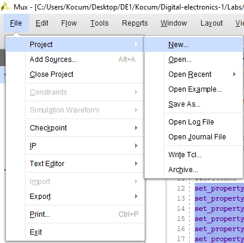

# Lab 3: Introduction to Vivado

## Preparation tasks (done before the lab at home)

1. Follow the instructions for [Windows](https://github.com/tomas-fryza/Digital-electronics-1/wiki/How-to-Install-Vivado-2020.2-on-Windows) or [Linux](https://github.com/tomas-fryza/Digital-electronics-1/wiki/How-to-Install-Vivado-2020.1-on-Linux), download and install Vivado Design Suite.

2. The Nexys A7 board provides sixteen switches and LEDs. The switches can be used to provide inputs, and the LEDs can be used as output devices. See [schematic](https://github.com/tomas-fryza/Digital-electronics-1/blob/master/Docs/nexys-a7-sch.pdf) or [reference manual](https://reference.digilentinc.com/reference/programmable-logic/nexys-a7/reference-manual) of the Nexys A7 board and find out the connection of slide switches and LEDs.

&nbsp;

&nbsp;

&nbsp;

&nbsp;

&nbsp;

&nbsp;

## 1. Preparation tasks (done before the lab at home). Submit:
    * Figure or table with connection of 16 slide switches and 16 LEDs on Nexys A7 board.

## 2. Two-bit wide 4-to-1 multiplexer. Submit:
    * Listing of VHDL architecture from source file `mux_2bit_4to1.vhd` with syntax highlighting,
    * Listing of VHDL stimulus process from testbench file `tb_mux_2bit_4to1.vhd` with syntax highlighting,
    * Screenshot with simulated time waveforms; always put all inputs and outputs.

## 3. A Vivado tutorial. Submit:
    * Your tutorial for Vivado design flow: project creation, adding source file, adding testbench file, running simulation, (adding XDC constraints file).

*Prepare all tasks in your README file `Digital-electronics-1/Labs/03-vivado/README.md`, [export/print it to PDF](https://github.com/tomas-fryza/Digital-electronics-1/wiki/Export-MD-to-PDF), use [BUT e-learning](https://moodle.vutbr.cz/) web page and submit a single PDF file. The deadline for submitting the task is the day before the next laboratory exercise.*
