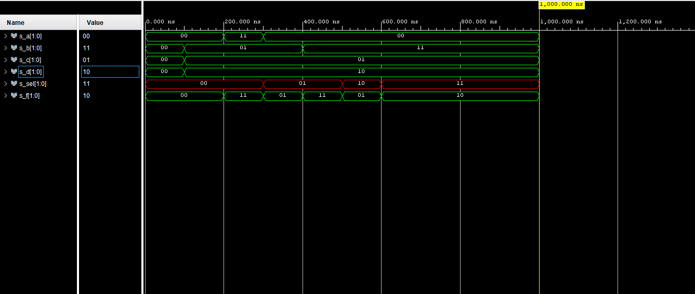

# Lab 3: Introduction to Vivado

&nbsp;

## 1. Preparation tasks (done before the lab at home). Submit:
### Figure or table with connection of 16 slide switches and 16 LEDs on Nexys A7 board.


&nbsp;

## 2. Two-bit wide 4-to-1 multiplexer. Submit:
### code design

```vhdl
------------------------------------------------------------------------
--
-- Example of 2-bit binary comparator using the when/else assignment.
-- EDA Playground
--
-- Copyright (c) 2020-2021 Tomas Fryza
-- Dept. of Radio Electronics, Brno University of Technology, Czechia
-- This work is licensed under the terms of the MIT license.
--
------------------------------------------------------------------------
library ieee;
use ieee.std_logic_1164.all;

------------------------------------------------------------------------
-- Entity declaration for 2-bit binary comparator
------------------------------------------------------------------------
entity mux_2bit_4to1 is
    port(
        a_i           : in  std_logic_vector(2 - 1 downto 0);
        b_i           : in  std_logic_vector(2 - 1 downto 0);
        c_i           : in  std_logic_vector(2 - 1 downto 0);
        d_i           : in  std_logic_vector(2 - 1 downto 0);
        sel_i         : in  std_logic_vector(2 - 1 downto 0);
       
        f_o           : out std_logic_vector(2 - 1 downto 0)

        
        
    );
end entity mux_2bit_4to1;

------------------------------------------------------------------------
-- Architecture body for 2-bit binary comparator
------------------------------------------------------------------------
architecture Behavioral of mux_2bit_4to1 is
begin
    
    f_o <=  a_i when (sel_i = "00") else
            b_i when (sel_i = "01") else
            c_i when (sel_i = "10") else
            d_i; 


end architecture Behavioral;

```

### testbench

```vhdl
------------------------------------------------------------------------
--
-- Testbench for 2-bit binary comparator.
-- EDA Playground
--
-- Copyright (c) 2020-2021 Tomas Fryza
-- Dept. of Radio Electronics, Brno University of Technology, Czechia
-- This work is licensed under the terms of the MIT license.
--
------------------------------------------------------------------------
library ieee;
use ieee.std_logic_1164.all;

------------------------------------------------------------------------
-- Entity declaration for testbench
------------------------------------------------------------------------
entity tb_mux_2bit_4to1 is
    -- Entity of testbench is always empty
end entity tb_mux_2bit_4to1;

------------------------------------------------------------------------
-- Architecture body for testbench
------------------------------------------------------------------------
architecture testbench of tb_mux_2bit_4to1 is

    -- Local signals
    signal s_a            : std_logic_vector(2 - 1 downto 0);
    signal s_b            : std_logic_vector(2 - 1 downto 0);
    signal s_c            : std_logic_vector(2 - 1 downto 0);
    signal s_d            : std_logic_vector(2 - 1 downto 0);
    signal s_sel          : std_logic_vector(2 - 1 downto 0);
    
    signal s_f            : std_logic_vector(2 - 1 downto 0);

begin
    -- Connecting testbench signals with comparator_4bit entity (Unit Under Test)
    uut_mux_2bit_4to1 : entity work.mux_2bit_4to1
        port map(
            a_i           => s_a,
            b_i           => s_b,
            c_i           => s_c,
            d_i           => s_d,
            sel_i         => s_sel,
            f_o           => s_f
        );

    --------------------------------------------------------------------
    -- Data generation process
    --------------------------------------------------------------------
    p_stimulus : process
    begin
        -- Report a note at the begining of stimulus process
        report "Stimulus process started" severity note;


        -- First test values
        s_d <= "00";s_c <= "00";s_b <= "00"; s_a <= "00"; 
        s_sel <= "00" ; wait for 10 ns;
        
        s_d <= "10";s_c <= "01";s_b <= "01"; s_a <= "00"; 
        s_sel <= "00" ; wait for 10 ns;
        
        s_d <= "10";s_c <= "01";s_b <= "01"; s_a <= "11"; 
        s_sel <= "00" ; wait for 10 ns;
        
        s_d <= "10";s_c <= "01";s_b <= "01"; s_a <= "00"; 
        s_sel <= "01" ; wait for 10 ns;
        
        s_d <= "10";s_c <= "01";s_b <= "11"; s_a <= "00"; 
        s_sel <= "01" ; wait for 10 ns;
        
        --s_d <= "10";s_c <= "01";s_b <= "11"; s_a <= "00"; 
        s_sel <= "10" ; wait for 10 ns;
        
        --s_d <= "10";s_c <= "01";s_b <= "11"; s_a <= "00"; 
        s_sel <= "11" ; wait for 10 ns;
        
        
        -- Report a note at the end of stimulus process
        report "Stimulus process finished" severity note;
        wait;
    end process p_stimulus;

end architecture testbench;

```


## simulated time waveforms



    

## 3. A Vivado tutorial. Submit:
#### firstly open vivado and click on File -> Project -> New...
&nbsp;

#### click next
&nbsp;

&nbsp;
#### give name to your project and select location path

&nbsp;
#### select rtl

&nbsp;
#### create source file

&nbsp;
#### next

&nbsp;
#### select your board

&nbsp;
#### finish

&nbsp;

##xdc file

```vhdl
set_property -dict { PACKAGE_PIN J15   IOSTANDARD LVCMOS33 } [get_ports { a_i[0] }]; #IO_L24N_T3_RS0_15 Sch=sw[0]
set_property -dict { PACKAGE_PIN L16   IOSTANDARD LVCMOS33 } [get_ports { a_i[1] }]; #IO_L3N_T0_DQS_EMCCLK_14 Sch=sw[1]
set_property -dict { PACKAGE_PIN M13   IOSTANDARD LVCMOS33 } [get_ports { b_i[0] }]; #IO_L6N_T0_D08_VREF_14 Sch=sw[2]
set_property -dict { PACKAGE_PIN R15   IOSTANDARD LVCMOS33 } [get_ports { b_i[1] }]; #IO_L13N_T2_MRCC_14 Sch=sw[3]
set_property -dict { PACKAGE_PIN R17   IOSTANDARD LVCMOS33 } [get_ports { c_i[0] }]; #IO_L12N_T1_MRCC_14 Sch=sw[4]
set_property -dict { PACKAGE_PIN T18   IOSTANDARD LVCMOS33 } [get_ports { c_i[1] }]; #IO_L7N_T1_D10_14 Sch=sw[5]
set_property -dict { PACKAGE_PIN U18   IOSTANDARD LVCMOS33 } [get_ports { d_i[0] }]; #IO_L17N_T2_A13_D29_14 Sch=sw[6]
set_property -dict { PACKAGE_PIN R13   IOSTANDARD LVCMOS33 } [get_ports { d_i[1] }]; #IO_L5N_T0_D07_14 Sch=sw[7]
set_property -dict { PACKAGE_PIN U11   IOSTANDARD LVCMOS33 } [get_ports { sel_i[14] }]; #IO_L19N_T3_A09_D25_VREF_14 Sch=sw[14]
set_property -dict { PACKAGE_PIN V10   IOSTANDARD LVCMOS33 } [get_ports { sel_i[15] }]; #IO_L21P_T3_DQS_14 Sch=sw[15]

## LEDs
set_property -dict { PACKAGE_PIN H17   IOSTANDARD LVCMOS33 } [get_ports { f_o[0] }]; #IO_L18P_T2_A24_15 Sch=led[0]
set_property -dict { PACKAGE_PIN K15   IOSTANDARD LVCMOS33 } [get_ports { f_o[1] }]; #IO_L24P_T3_RS1_15 Sch=led[1]
```
