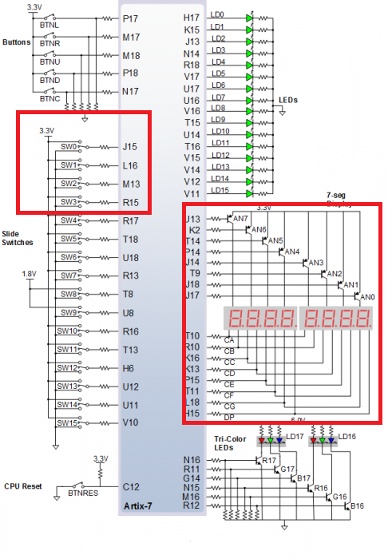
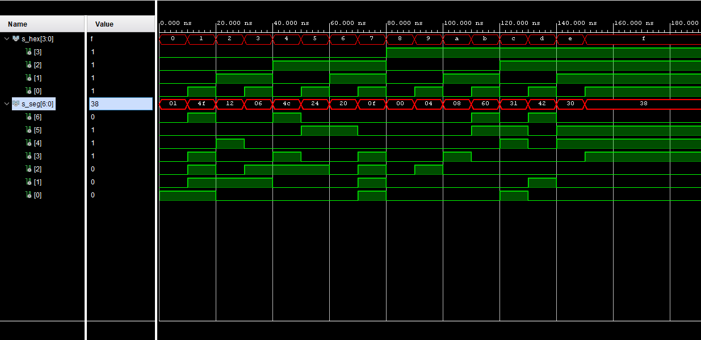

# Digital-electronics-1

## Lab assignment 3)

### Preparation tasks:

Decoder truth table for common anode 7-segment display.

| **Hex** | **Inputs** | **A** | **B** | **C** | **D** | **E** | **F** | **G** |
| :-: | :-: | :-: | :-: | :-: | :-: | :-: | :-: | :-: |
| 0 | 0000 | 0 | 0 | 0 | 0 | 0 | 0 | 1 |
| 1 | 0001 | 1 | 0 | 0 | 1 | 1 | 1 | 1 |
| 2 | 0010 | 0 | 0 | 1 | 0 | 0 | 1 | 0 |
| 3 | 0011 | 0 | 0 | 0 | 0 | 1 | 1 | 0 |
| 4 | 0100 | 1 | 0 | 0 | 1 | 1 | 0 | 0 | 
| 5 | 0101 | 0 | 1 | 0 | 0 | 1 | 0 | 0 |
| 6 | 0110 | 0 | 1 | 0 | 0 | 0 | 0 | 0 |
| 7 | 0111 | 0 | 0 | 0 | 1 | 1 | 1 | 1 |
| 8 | 1000 | 0 | 0 | 0 | 0 | 0 | 0 | 0 |
| 9 | 1001 | 0 | 0 | 0 | 0 | 1 | 0 | 0 |
| A | 1010 | 0 | 0 | 0 | 1 | 0 | 0 | 0 |
| b | 1011 | 1 | 1 | 0 | 0 | 0 | 0 | 0 |
| C | 1100 | 0 | 1 | 1 | 0 | 0 | 0 | 1 |
| d | 1101 | 1 | 0 | 0 | 0 | 0 | 1 | 0 |
| E | 1110 | 0 | 1 | 1 | 0 | 0 | 0 | 0 |
| F | 1111 | 0 | 1 | 1 | 1 | 0 | 0 | 0 |



### Seven-segment display decoder

#### Arcitecture code (hex_7seg.vhd)

```vhdl
----------------------------------------------------------------------------------
-- Company: 
-- Engineer: 
-- 
-- Create Date: 05.03.2021 12:59:38
-- Design Name: 
-- Module Name: hex_7seg - Behavioral
-- Project Name: 
-- Target Devices: 
-- Tool Versions: 
-- Description: 
-- 
-- Dependencies: 
-- 
-- Revision:
-- Revision 0.01 - File Created
-- Additional Comments:
-- 
----------------------------------------------------------------------------------


library IEEE;
use IEEE.STD_LOGIC_1164.ALL;

-- Uncomment the following library declaration if using
-- arithmetic functions with Signed or Unsigned values
--use IEEE.NUMERIC_STD.ALL;

-- Uncomment the following library declaration if instantiating
-- any Xilinx leaf cells in this code.
--library UNISIM;
--use UNISIM.VComponents.all;

entity hex_7seg is
    Port 
    (
        hex_i : in  STD_LOGIC_VECTOR (4 - 1 downto 0);
        seg_o : out STD_LOGIC_VECTOR (7 - 1 downto 0)
           
    );
end hex_7seg;

architecture Behavioral of hex_7seg is

begin
    p_7seg_decoder : process(hex_i)
        begin
            case hex_i is
                when "0000" =>
                    seg_o <= "0000001";     -- 0
                when "0001" =>
                    seg_o <= "1001111";     -- 1
                when "0010" =>
                    seg_o <= "0010010";     -- 2
                when "0011" =>
                    seg_o <= "0000110";     -- 3
                when "0100" =>
                    seg_o <= "1001100";     -- 4
                when "0101" =>
                    seg_o <= "0100100";     -- 5
                when "0110" =>
                    seg_o <= "0100000";     -- 6
                when "0111" =>
                    seg_o <= "0001111";     -- 7
                when "1000" =>
                    seg_o <= "0000000";     -- 8
                when "1001" =>
                    seg_o <= "0000100";     -- 9
                when "1010" =>
                    seg_o <= "0001000";     -- A 
                when "1011" =>
                    seg_o <= "1100000";     -- B 
                when "1100" =>
                    seg_o <= "0110001";     -- C 
                when "1101" =>
                    seg_o <= "1000010";     -- D 
                when "1110" =>
                    seg_o <= "0110000";     -- E 
                when others =>
                    seg_o <= "0111000";     -- F 
            end case;
        end process p_7seg_decoder;


end Behavioral;

```

#### Testbench code (tb_hex_7seg.vhd)

```vhdl
----------------------------------------------------------------------------------
-- Company: 
-- Engineer: 
-- 
-- Create Date: 06.03.2021 09:36:19
-- Design Name: 
-- Module Name: tb_hex_7seg - Behavioral
-- Project Name: 
-- Target Devices: 
-- Tool Versions: 
-- Description: 
-- 
-- Dependencies: 
-- 
-- Revision:
-- Revision 0.01 - File Created
-- Additional Comments:
-- 
----------------------------------------------------------------------------------


library IEEE;
use IEEE.STD_LOGIC_1164.ALL;

-- Uncomment the following library declaration if using
-- arithmetic functions with Signed or Unsigned values
--use IEEE.NUMERIC_STD.ALL;

-- Uncomment the following library declaration if instantiating
-- any Xilinx leaf cells in this code.
--library UNISIM;
--use UNISIM.VComponents.all;

entity tb_hex_7seg is
--  Port ( );
end tb_hex_7seg;

architecture Behavioral of tb_hex_7seg is
    signal s_hex            : std_logic_vector(4 - 1 downto 0);
    signal s_seg            : std_logic_vector(7 - 1 downto 0);

    
begin

 -- Connecting testbench signals with comparator_4bit entity (Unit Under Test)
    uut_hex_7seg : entity work.hex_7seg
        port map(
            hex_i           => s_hex,
            seg_o           => s_seg
        );


    p_stimulus : process
    begin
        -- Report a note at the begining of stimulus process
        report "Stimulus process started. ---------------------------------------" severity note;
        
        -- TEST 0
        report "Testing 0 ..." severity note;
        s_hex <= "0000";
        wait for 10 ns;
        assert (s_seg = "0000001")
        report "Test failed for input combination: 0" severity error;
        
        -- TEST 1
        report "Testing 1 ..." severity note;
        s_hex <= "0001";
        wait for 10 ns;
        assert (s_seg = "1001111")
        report "Test failed for input combination: 1" severity error; 
        
        -- TEST 2
        report "Testing 2 ..." severity note;
        s_hex <= "0010";
        wait for 10 ns;
        assert (s_seg = "0010010")
        report "Test failed for input combination: 2" severity error; 
        
        -- TEST 3
        report "Testing 3 ..." severity note;
        s_hex <= "0011";
        wait for 10 ns;
        assert (s_seg = "0000110")
        report "Test failed for input combination: 3" severity error; 
        
        -- TEST 4
        report "Testing 4 ..." severity note;
        s_hex <= "0100";
        wait for 10 ns;
        assert (s_seg = "1001100")
        report "Test failed for input combination: 4" severity error; 
        
        -- TEST 5
        report "Testing 5 ..." severity note;
        s_hex <= "0101";
        wait for 10 ns;
        assert (s_seg = "0100100")
        report "Test failed for input combination: 5" severity error; 
        
        -- TEST 6
        report "Testing 6 ..." severity note;
        s_hex <= "0110";
        wait for 10 ns;
        assert (s_seg = "0100000")
        report "Test failed for input combination: 6" severity error; 
        
        -- TEST 7
        report "Testing 7 ..." severity note;
        s_hex <= "0111";
        wait for 10 ns;
        assert (s_seg = "0001111")
        report "Test failed for input combination: 7" severity error; 
        
        -- TEST 8
        report "Testing 8 ..." severity note;
        s_hex <= "1000";
        wait for 10 ns;
        assert (s_seg = "0000000")
        report "Test failed for input combination: 8" severity error; 
        
        -- TEST 9
        report "Testing 9 ..." severity note;
        s_hex <= "1001";
        wait for 10 ns;
        assert (s_seg = "0000100")
        report "Test failed for input combination: 9" severity error; 
        
        -- TEST 10 (A)
        report "Testing 10 ..." severity note;
        s_hex <= "1010";
        wait for 10 ns;
        assert (s_seg = "0001000")
        report "Test failed for input combination: 10" severity error; 
        
        -- TEST 11 (B)
        report "Testing 11 ..." severity note;
        s_hex <= "1011";
        wait for 10 ns;
        assert (s_seg = "1100000")
        report "Test failed for input combination: 11" severity error; 
        
        -- TEST 12 (C)
        report "Testing 12 ..." severity note;
        s_hex <= "1100";
        wait for 10 ns;
        assert (s_seg = "0110001")
        report "Test failed for input combination: 12" severity error; 
        
        -- TEST 13 (D)
        report "Testing 13 ..." severity note;
        s_hex <= "1101";
        wait for 10 ns;
        assert (s_seg = "1000010")
        report "Test failed for input combination: 13" severity error; 
        
        -- TEST 14 (E)
        report "Testing 14 ..." severity note;
        s_hex <= "1110";
        wait for 10 ns;
        assert (s_seg = "0110000")
        report "Test failed for input combination: 14" severity error;
        
        -- TEST 15 (F)
        report "Testing 15 ..." severity note;
        s_hex <= "1111";
        wait for 10 ns;
        assert (s_seg = "0111000")
        report "Test failed for input combination: 15" severity error;      
        
        -- Report a note at the end of stimulus process
        report "Stimulus process finished. ---------------------------------------" severity note;
        wait;       
    end process p_stimulus;
end Behavioral;
```

#### Simulated waveform 



### Top (top.vhd)

```vhdl
    
    
    
```

### LED[7:4] truth table

| **Hex** | **Inputs** | **LED[7]** | **LED[6]** | **LED[5]** | **LED[4]** |
| :-: | :-: | :-: | :-: | :-: | :-: |
| 0 | 0000 | 0 | 0 | 0 | 1 |
| 1 | 0001 | 1 | 1 | 0 | 0 |
| 2 | 0010 | 1 | 0 | 1 | 0 |
| 3 | 0011 | 0 | 1 | 0 | 0 |
| 4 | 0100 | 1 | 0 | 0 | 0 |
| 5 | 0101 | 0 | 1 | 0 | 0 |
| 6 | 0110 | 0 | 0 | 0 | 0 |
| 7 | 0111 | 0 | 1 | 0 | 0 |
| 8 | 1000 | 1 | 0 | 0 | 0 |
| 9 | 1001 | 0 | 1 | 0 | 0 |
| A | 1010 | 0 | 0 | 1 | 0 |
| b | 1011 | 0 | 1 | 1 | 0 |
| C | 1100 | 0 | 0 | 1 | 0 |
| d | 1101 | 0 | 1 | 1 | 0 |
| E | 1110 | 0 | 0 | 1 | 0 |
| F | 1111 | 0 | 1 | 1 | 0 |


