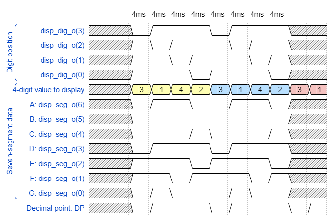

# Part 1: Preparation tasks
## Timing diagram figure for displaying value 3.142
```javascript
{signal: [
  ['Digit position',
    {name: 'disp_dig_o(3)', wave: 'xx01..01..xx', },
    {name: 'disp_dig_o(2)', wave: 'xx101..01.xx', },
    {name: 'disp_dig_o(1)', wave: 'xx1.01..01xx', },
    {name: 'disp_dig_o(0)', wave: 'xx1..01..0xx', },
  ],
  ['Seven-segment data',
    {name: '4-digit value to display', wave: 'xx3333555599', data: ['3','1','4','2','3','1','4','2','3','1']}, 
    {name: 'A: disp_seg_o(6)', wave: 'xx01.0.1.0x.', },
    {name: 'B: disp_seg_o(5)', wave: 'xx0.......xx', },
    {name: 'C: disp_seg_o(4)', wave: 'xx0..10..1xx', },
    {name: 'D: disp_seg_o(3)', wave: 'xx01..01..xx', },
    {name: 'E: disp_seg_o(2)', wave: 'xx1..01..0xx', },
    {name: 'F: disp_seg_o(1)', wave: 'xx1.01..01xx', },
    {name: 'G: disp_seg_o(0)', wave: 'xx010..10.xx', },
  ],
  {name: 'Decimal point: DP', wave: 'xx01..01..01'},
],
  head: {
    text: '4ms   4ms   4ms   4ms   4ms   4ms   4ms   4ms',
  },
}
```

## listing of pmux
```vhdl
p_mux : process(s_cnt, data0_i, data1_i, data2_i, data3_i, dp_i) 
begin                                                            
    case s_cnt is                                                
        when "11" =>                                             
            s_hex <= data3_i;                                    
            dp_o  <= dp_i(3);                                    
            dig_o <= "0111";                                     
                                                                 
        when "10" =>                                             
            s_hex <= data2_i;                                    
            dp_o  <= dp_i(2);                                    
            dig_o <= "1011";                                     
                                                                 
        when "01" =>                                             
            s_hex <= data1_i;                                    
            dp_o  <= dp_i(1);                                    
            dig_o <= "1101";                                     
                                                                 
        when others =>                                           
            s_hex <= data0_i;                                    
            dp_o  <= dp_i(0);                                    
            dig_o <= "1110";                                     
     end case;                                                   
end process p_mux;   
```
