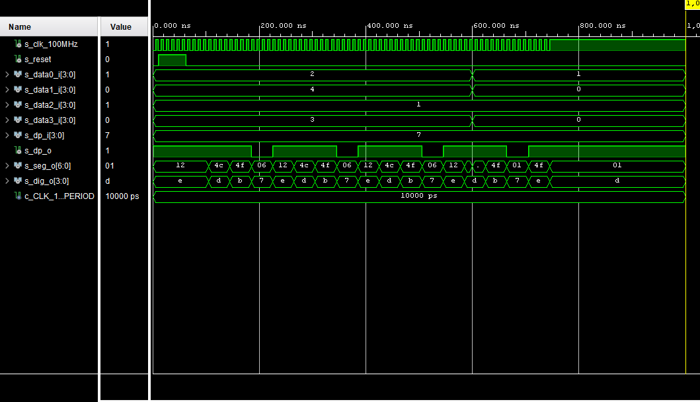
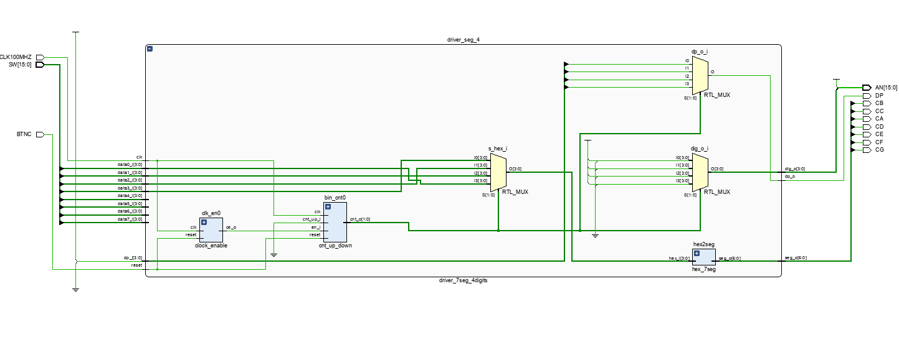

# Part 1: Preparation tasks
## Timing diagram figure for displaying value 3.142
```javascript
{signal: [
  ['Digit position',
    {name: 'disp_dig_o(3)', wave: 'xx01..01..xx', },
    {name: 'disp_dig_o(2)', wave: 'xx101..01.xx', },
    {name: 'disp_dig_o(1)', wave: 'xx1.01..01xx', },
    {name: 'disp_dig_o(0)', wave: 'xx1..01..0xx', },
  ],
  ['Seven-segment data',
    {name: '4-digit value to display', wave: 'xx3333555599', data: ['3','1','4','2','3','1','4','2','3','1']}, 
    {name: 'A: disp_seg_o(6)', wave: 'xx01.0.1.0x.', },
    {name: 'B: disp_seg_o(5)', wave: 'xx0.......xx', },
    {name: 'C: disp_seg_o(4)', wave: 'xx0..10..1xx', },
    {name: 'D: disp_seg_o(3)', wave: 'xx01..01..xx', },
    {name: 'E: disp_seg_o(2)', wave: 'xx1..01..0xx', },
    {name: 'F: disp_seg_o(1)', wave: 'xx1.01..01xx', },
    {name: 'G: disp_seg_o(0)', wave: 'xx010..10.xx', },
  ],
  {name: 'Decimal point: DP', wave: 'xx01..01..01'},
],
  head: {
    text: '4ms   4ms   4ms   4ms   4ms   4ms   4ms   4ms',
  },
}
```

## Listing of VHDL code of the process p_mux with syntax highlighting.
```vhdl
p_mux : process(s_cnt, data0_i, data1_i, data2_i, data3_i, dp_i) 
begin                                                            
    case s_cnt is                                                
        when "11" =>                                             
            s_hex <= data3_i;                                    
            dp_o  <= dp_i(3);                                    
            dig_o <= "0111";                                     
                                                                 
        when "10" =>                                             
            s_hex <= data2_i;                                    
            dp_o  <= dp_i(2);                                    
            dig_o <= "1011";                                     
                                                                 
        when "01" =>                                             
            s_hex <= data1_i;                                    
            dp_o  <= dp_i(1);                                    
            dig_o <= "1101";                                     
                                                                 
        when others =>                                           
            s_hex <= data0_i;                                    
            dp_o  <= dp_i(0);                                    
            dig_o <= "1110";                                     
     end case;                                                   
end process p_mux;   
```
## Listing of VHDL testbench file tb_driver_7seg_4digits with syntax highlighting and asserts,
```vhdl
library ieee;
use ieee.std_logic_1164.all;

------------------------------------------------------------------------
-- Entity declaration for testbench
------------------------------------------------------------------------
entity tb_driver_7seg_4digits is
    -- Entity of testbench is always empty
end entity tb_driver_7seg_4digits;

------------------------------------------------------------------------
-- Architecture body for testbench
------------------------------------------------------------------------
architecture testbench of tb_driver_7seg_4digits is

    -- Local constants
    constant c_CLK_100MHZ_PERIOD : time    := 10 ns;

    --Local signals
    signal s_clk_100MHz : std_logic;
    --- WRITE YOUR CODE HERE    
    signal s_reset    : std_logic;
    
    signal s_data0_i  : std_logic_vector(4 - 1 downto 0);
    signal s_data1_i  : std_logic_vector(4 - 1 downto 0);
    signal s_data2_i  : std_logic_vector(4 - 1 downto 0);
    signal s_data3_i  : std_logic_vector(4 - 1 downto 0);
    
    signal s_dp_i     : std_logic_vector(4 - 1 downto 0);
    signal s_dp_o     : std_logic;
    
    signal s_seg_o    : std_logic_vector(7 - 1 downto 0);
    signal s_dig_o    : std_logic_vector(4 - 1 downto 0);
begin
    -- Connecting testbench signals with driver_7seg_4digits entity
    -- (Unit Under Test)
    --- WRITE YOUR CODE HERE
    uut_driver_7seg : entity work.driver_7seg_4digits
    --------------------------------------------------------------------
    port map(                 
            clk     => s_clk_100MHz,
            reset   => s_reset,
                  
            data0_i => s_data0_i,
            data1_i => s_data1_i,
            data2_i => s_data2_i,
            data3_i => s_data3_i,           
              
            dp_i    => s_dp_i,  
            dp_o    => s_dp_o,  
            seg_o   => s_seg_o, 
            dig_o   => s_dig_o
            );                        
    --------------------------------------------------------------------
    p_clk_gen : process
    begin
        while now < 750 ns loop         -- 75 periods of 100MHz clock
            s_clk_100MHz <= '0';
            wait for c_CLK_100MHZ_PERIOD / 2;
            s_clk_100MHz <= '1';
            wait for c_CLK_100MHZ_PERIOD / 2;
        end loop;
        wait;
    end process p_clk_gen;

    --------------------------------------------------------------------
    -- Reset generation process
    --------------------------------------------------------------------
    --- WRITE YOUR CODE HERE
    p_reset_gen : process
    begin
        s_reset <= '0';
        wait for 10 ns;
        
        -- Reset activated
        s_reset <= '1';
        wait for 53 ns;

        -- Reset deactivated
        s_reset <= '0';

        wait;
    end process p_reset_gen;

    --------------------------------------------------------------------
    -- Data generation process
    --------------------------------------------------------------------
    p_stimulus : process
    begin
        report "Stimulus process started" severity note;
        
        s_data3_i      <= "0011";
        s_data2_i      <= "0001";
        s_data1_i      <= "0100";
        s_data0_i      <= "0010";
        s_dp_i         <= "0111";
        
        wait for 600 ns;
        s_data3_i      <= "0000";
        s_data2_i      <= "0001";
        s_data1_i      <= "0000";
        s_data0_i      <= "0001";
        
        report "Stimulus process finished" severity note;
        wait;
    end process p_stimulus;
end architecture testbench;

```

##Listing of VHDL architecture of the top layer.
```vhdl
architecture Behavioral of top is
    -- No internal signals
begin

    --------------------------------------------------------------------
    -- Instance (copy) of driver_7seg_4digits entity
    driver_seg_4 : entity work.driver_7seg_4digits
        port map(
            clk        => CLK100MHZ,
            reset      => BTNC,
            data0_i(3) => SW(3),
            data0_i(2) => SW(2),
            data0_i(1) => SW(1),
            data0_i(0) => SW(0),
            --
            data1_i(3) => SW(7),
            data1_i(2) => SW(6),
            data1_i(1) => SW(5),
            data1_i(0) => SW(4),
            --
            data2_i(3)=> SW(11),
            data2_i(2)=> SW(10),
            data2_i(1) => SW(9),
            data2_i(0) => SW(8),
            --
            data3_i(3) => SW(15),
            data3_i(2) => SW(14),
            data3_i(1) => SW(13),
            data3_i(0) => SW(12),
            
            dig_o =>    AN(4-1 downto 0),
            
            seg_o(0)    =>  CA,
            seg_o(1)    =>  CB,
            seg_o(2)    =>  CC,
            seg_o(3)    =>  CD,
            seg_o(4)    =>  CE,
            seg_o(5)    =>  CF,
            seg_o(6)    =>  CG, 
            
            dp_i => "0111",
            dp_o => DP
            --- WRITE YOUR CODE HERE
        );

    -- Disconnect the top four digits of the 7-segment display
    AN(7 downto 4) <= b"1111";

end architecture Behavioral;
```

