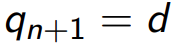
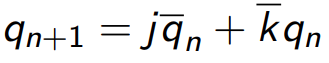
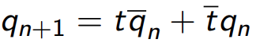

# Lab 7: Latches and Flip-flops

### Learning objectives

## Preparation tasks (done before the lab at home)

Write characteristic equations and complete truth tables for D, JK, T flip-flops where `q(n)` represents main output value before the clock edge and `q(n+1)` represents value after the clock edge.

   
   
   | **clk** | **d** | **q(n)** | **q(n+1)** | **Comments** |
   | :-: | :-: | :-: | :-: | :-- |
   |  | 0 | 0 | 0  | no change |
   |  | 0 | 1 | 0 | change |
   |  | 1 | 0 | 1 | change |
   |  | 1 | 1 | 1 | no change |
   
   
   
   | **clk** | **j** | **k** | **q(n)** | **q(n+1)** | **Comments** |
   | :-: | :-: | :-: | :-: | :-: | :-- |
   |  | 0 | 0 | 0 | 0 | No change |
   |  | 0 | 0 | 1 | 1 | No change |
   |  | 0 | 1 | 0 | 0 | reset |
   |  | 0 | 1 | 1 | 0 | reset |
   |  | 1 | 0 | 0 | 1 | set |
   |  | 1 | 0 | 1 | 1 | set |
   |  | 1 | 1 | 0 | 1 | toggle |
   |  | 1 | 1 | 1 | 0 | toggle |
   
   
   
   | **clk** | **t** | **q(n)** | **q(n+1)** | **Comments** |
   | :-: | :-: | :-: | :-: | :-- |
   |  | 0 | 0 | 0 | no change |
   |  | 0 | 1 | 1 | no change |
   |  | 1 | 0 | 1 | toggle |
   |  | 1 | 1 | 0 | toggle |


## Part 2: D latch
### VHDL code listing of the process p_d_latch with syntax highlighting
### VHDL CODE 
```vhdl
 entity d_latch is                     
    Port (                            
        en     :in STD_LOGIC;         
        arst   :in STD_LOGIC;         
        d      :in STD_LOGIC;         
        q      :out STD_LOGIC;        
        q_bar  :out STD_LOGIC         
        );                            
end d_latch;                          
                                      
architecture Behavioral of d_latch is 
                                      
begin                                 
    p_d_latch : process (d, arst, en) 
    begin                             
        if (arst = '1') then          
             q      <= '0';           
             q_bar  <= '1';           
        elsif (en = '1') then         
             q      <= d;             
             q_bar  <= not d;         
        end if;                       
    end process p_d_latch;            
                                      
end Behavioral;                       
```

### Listing of VHDL reset and stimulus processes from the testbench tb_d_latch file with syntax highlighting and asserts
### VHDL CODE
```vhdl
    p_stimulus : process
    begin
            report "Stimulus process started" severity note;
            s_en    <= '0';
            s_d     <= '0';
            --s_arst  <= '0';
    
            -- d sequence
            wait for 10 ns; 
            s_d <= '1';
            wait for 10 ns; 
            s_d <= '0';
            wait for 10 ns; 
            s_d <= '1';
            wait for 10 ns; 
            s_d <= '0';
            wait for 10 ns; 
            s_d <= '1';
            wait for 10 ns; 
            s_d <= '0';
            wait for 8 ns;
            -- /d sequence
            
            s_en <= '1'; wait for 5 ns;
            assert(s_q = '0' and s_q_bar = '1') 
            report " s_q,q_bar expected 01" severity error;
        
            wait for 6 ns;             
            s_d  <= '1';
            wait for 8 ns;
            s_d  <= '0';
            wait for 10 ns;
            s_d  <= '1';
            wait for 10 ns;
            s_d  <= '0';
            wait for 5 ns;
            s_d  <= '1';
            wait for 10 ns;
            s_d  <= '0';
            wait for 10 ns;  
            
            s_en <= '0'; 
            assert(s_q = '1' and s_q_bar = '0') 
            report " asrt expected 1" severity error;
          
            
            wait for 10 ns; 
            s_d  <= '1';
            wait for 10 ns;
            s_d  <= '0';
            wait for 10 ns;
            s_d  <= '1';
            wait for 10 ns;
            s_d  <= '0';
            wait for 10 ns;
            s_d  <= '1';
            wait for 10 ns;
            s_d  <= '0';
            wait for 10 ns; 
            
            s_en <= '1'; wait for 10 ns;
            assert(s_q = '0' and s_q_bar = '1') 
            report " asrt expected 1" severity error;
            
            report "Stimulus process finished" severity note;
        
        wait;
    end process p_stimulus;
```

### Screenshot with simulated time waveforms; always display all inputs and outputs. The full functionality of the entity must be verified
  


## Lab assignment

1. Preparation tasks (done before the lab at home). Submit:
    * Characteristic equations and completed tables for D, JK, T flip-flops.

2. D latch. Submit:
    * VHDL code listing of the process `p_d_latch` with syntax highlighting,
    * Listing of VHDL reset and stimulus processes from the testbench `tb_d_latch.vhd` file with syntax highlighting and asserts,
    * Screenshot with simulated time waveforms; always display all inputs and outputs. The full functionality of the entity must be verified.

3. Flip-flops. Submit:
    * VHDL code listing of the processes `p_d_ff_arst`, `p_d_ff_rst`, `p_jk_ff_rst`, `p_t_ff_rst` with syntax highlighting,
    * Listing of VHDL clock, reset and stimulus processes from the testbench files with syntax highlighting and asserts,
    * Screenshot with simulated time waveforms; always display all inputs and outputs. The full functionality of the entities must be verified.

4. Shift register. Submit:
    * Image of the shift register schematic. The image can be drawn on a computer or by hand. Name all inputs, outputs, components and internal signals.

*Prepare all parts of the assignment on a computer (not by hand), insert them in your README file `Digital-electronics-1/Labs/07-ffs/README.md`, export the formated output (not the listing in markdown language) from [HTML to PDF](https://github.com/tomas-fryza/Digital-electronics-1/wiki/Export-README-to-PDF), use [BUT e-learning](https://moodle.vutbr.cz/) web page and submit a single PDF file. The deadline for submitting the task is the day before the next laboratory exercise.*
